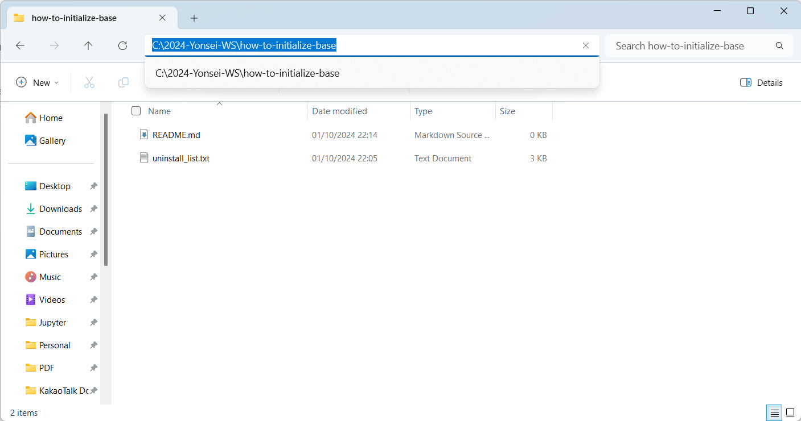
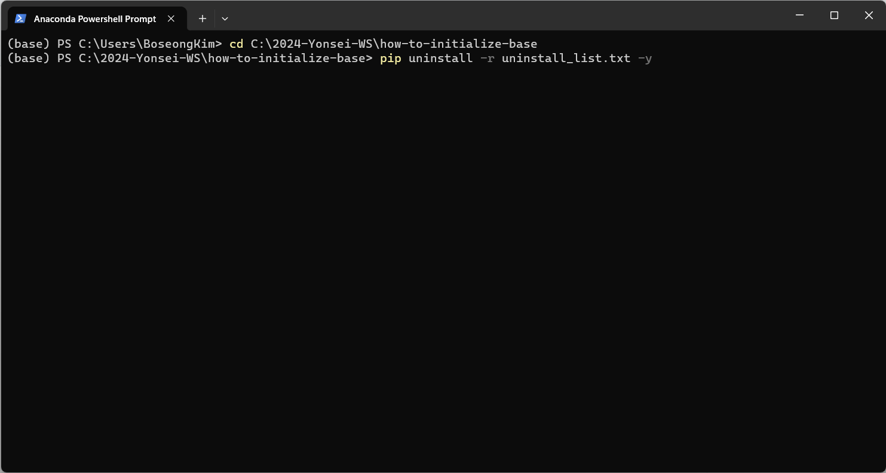

# base에 잘못 설치한 qiskit 패키지들을 삭제하는 법

죄송합니다... 수업 진행 중 conda 가상환경을 활성화하는 과정을 까먹고 바로 pip install 명령어를 실행해 base 환경에 qiskit을 설치하신 분들이 계실 것 같습니다.

혹시 실수로 설치된 패키지들을 삭제하고 싶으신 분들을 위해 base에 잘못 설치한 qiskit 패키지들을 삭제하는 법을 정리해 알려드립니다.

**주의!**

base(기본 miniconda 환경)에 다른 패키지들을 설치해서 사용하고 계시던 분들은 qiskit 패키지를 굳이 삭제하실 필요도 없고 삭제하셔도 안 됩니다!

### 삭제 방법

1. 이 폴더 내의 uninstall_list.txt 를 다운로드하고 파일 위치를 확인해주세요. (예시에서는 C:\2024-Yonsei-WS\how-to-initialize-base 에 파일이 있습니다.)

2. 파일이 존재하는 폴더 경로를 복사합니다.

3. 아나콘다 프롬프트를 열고 아래와 같이 커맨드를 입력합니다. (cd 뒤에는 복사한 경로를 붙여넣기 해주세요.)

4. uninstall_list.txt 로부터 패키지 리스트를 가져와 삭제가 진행됩니다.

번거롭게 해드려 죄송합니다...
